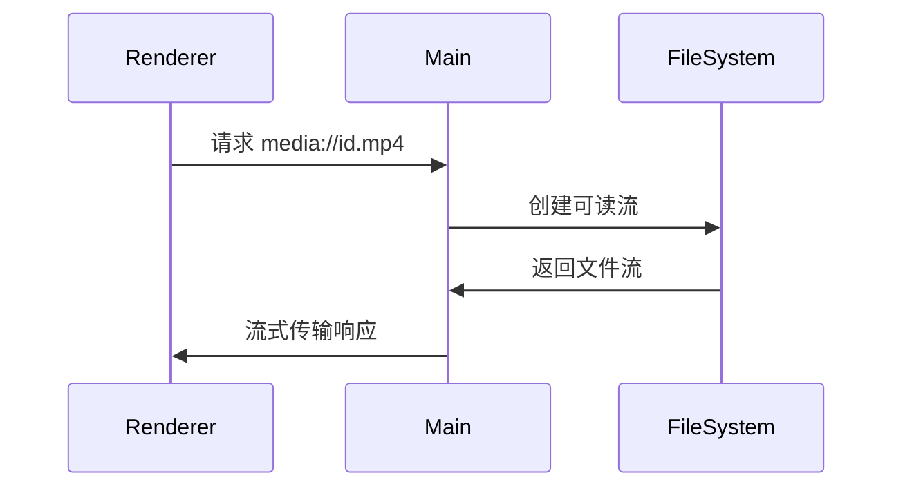

## 1.引言

在桌面应用开发中，本地视频的高效加载与播放是提升用户体验的关键。本文介绍如何通过 Electron 的协议处理器与 Node.js 流式 API，实现高性能的本地视频加载方案。

### 自定义协议流传输的优势

| 特性         | 文件路径       | Blob             | 流式传输       |
| ------------ | -------------- | ---------------- | -------------- |
| 内存占用     | 高（线性增长） | 极高（全量驻留） | 低（动态分片） |
| 大文件支持   | ❌             | ❌               | ✅             |
| 首帧时间     | 慢             | 慢               | 快             |
| 拖拽播放     | 卡顿           | 卡顿             | 流畅           |
| 内存泄漏风险 | 中             | 高               | 低             |

## 2. 核心实现原理

### 2.1 协议层架构设计



### 2.2 关键技术选型

- **Electron Protocol API**：注册自定义协议替代`file://`
- **Node.js Stream**：实现分块读取与传输
- **HTTP Range**：支持视频播放器范围请求

## 3. 技术实现

### 3.1 安全映射机制

在主进程中实现一个 map 将真实路径存放起来，当使用 electron dialog 选择文件后，可以生成一个 id 返回给 renderer 端，renderer 端通过 id 来获取

```ts
const mediaFileMap = new Map<string, string>();

export const addMediaFile = (id: string, path: string) => {
  mediaFileMap.set(id, path);
};

export const getMediaFile = (id: string) => {
  return mediaFileMap.get(id);
};

export const removeMediaFile = (id: string) => {
  mediaFileMap.delete(id);
};

export const clearMediaFileMap = () => {
  mediaFileMap.clear();
};

```

这样做的好处有两点：

- 避免暴露真实路径
- 如果路径中有空格等特殊字符串，经过 encodeURIComponent 后，会传递不到给自定义的 Protocol

### 3.2 协议注册与配置

```ts
import { protocol } from 'electron';

protocol.registerSchemesAsPrivileged([
  {
    scheme: 'media', // 自定义协议名
    privileges: {
      standard: true, // 标准权限
      secure: true, // 安全上下文
      stream: true, // 支持流式传输
      bypassCSP: true, // 绕过内容安全策略
    },
  },
]);
```

### 3.3 路径获取

```ts
import path from 'path';
import { existsSync } from 'fs';
import { getMediaFile } from '../utils/store/media-file-map';

const getMediaFilePath = (reqUrl: string) => {
  const filePath = decodeURIComponent(reqUrl.replace('media://', ''));
  // 渲染端通过传id.[ext]来获取对应的路径
  const [id] = filePath.split('.');
  const mediaFilePath = getMediaFile(id);

  if (!mediaFilePath) {
    return '';
  }

  const normalizedPath = path.normalize(mediaFilePath);

  if (!existsSync(normalizedPath)) {
    return '';
  }

  return normalizedPath;
};

```

### 3.4 获取 range

```ts
import { promises } from 'fs';

const getRange = async (normalizedPath: string, rangeHeader: string | null) => {
  const { size } = await promises.stat(normalizedPath);
  let start = 0,
    end = size - 1;
  if (rangeHeader) {
    const match = rangeHeader.match(/bytes=(\d*)-(\d*)/);
    if (match) {
      start = match[1] ? parseInt(match[1], 10) : start;
      end = match[2] ? parseInt(match[2], 10) : end;
    }
  }
  const chunkSize = (end || size - 1) - start + 1;

  return { start, end, chunkSize, size };
};
```

### 3.5 实现流式响应

```ts
export const initMediaProtocol = () => {
  protocol.handle('media', async (req) => {
    try {
      const normalizedPath = getMediaFilePath(req.url);

      if (!normalizedPath) {
        return new Response('File not found', { status: 404 });
      }

      const rangeHeader = req.headers.get('Range');

      const { start, end, chunkSize, size } = await getRange(normalizedPath, rangeHeader);

      const stream = createReadStream(normalizedPath, { start, end });
      stream.on('error', (error) => {
        stream.destroy();
        return new Response(`Error: ${error.message}`, { status: 500 });
      });
      return new Response(stream as any, {
        status: rangeHeader ? 206 : 200,
        headers: {
          'Content-Range': `bytes ${start}-${end || size - 1}/${size}`,
          'Accept-Ranges': 'bytes',
          'Content-Length': chunkSize.toString(),
          'Content-Type': getContentType(normalizedPath),
        },
      });
    } catch (error: any) {
      console.error('Error handling media protocol:', error);
      return new Response(`Error: ${error.message}`, { status: 500 });
    }
  });
};
```

**initMediaProtocol**这个方法要在 app when ready 后执行。

### 完整代码实现

```ts
import { protocol } from 'electron';
import path from 'path';
import { getMediaFile } from '../utils/store/media-file-map';
import { getContentType } from '../utils/content-type';
import { createReadStream, existsSync, promises } from 'fs';

protocol.registerSchemesAsPrivileged([
  {
    scheme: 'media',
    privileges: {
      standard: true, // 标准权限
      secure: true, // 安全上下文
      stream: true, // 支持流式传输
      bypassCSP: true, // 绕过内容安全策略
    },
  },
]);

const getMediaFilePath = (reqUrl: string) => {
  const filePath = decodeURIComponent(reqUrl.replace('media://', ''));
  const [id] = filePath.split('.');
  const mediaFilePath = getMediaFile(id);

  if (!mediaFilePath) {
    return '';
  }

  const normalizedPath = path.normalize(mediaFilePath);

  if (!existsSync(normalizedPath)) {
    return '';
  }

  return normalizedPath;
};

const getRange = async (normalizedPath: string, rangeHeader: string | null) => {
  const { size } = await promises.stat(normalizedPath);
  let start = 0,
    end = size - 1;
  if (rangeHeader) {
    const match = rangeHeader.match(/bytes=(\d*)-(\d*)/);
    if (match) {
      start = match[1] ? parseInt(match[1], 10) : start;
      end = match[2] ? parseInt(match[2], 10) : end;
    }
  }
  const chunkSize = (end || size - 1) - start + 1;

  return { start, end, chunkSize, size };
};

export const initMediaProtocol = () => {
  protocol.handle('media', async (req) => {
    try {
      const normalizedPath = getMediaFilePath(req.url);

      if (!normalizedPath) {
        return new Response('File not found', { status: 404 });
      }

      const rangeHeader = req.headers.get('Range');

      const { start, end, chunkSize, size } = await getRange(normalizedPath, rangeHeader);

      const stream = createReadStream(normalizedPath, { start, end });
      stream.on('error', (error) => {
        stream.destroy();
        return new Response(`Error: ${error.message}`, { status: 500 });
      });
      return new Response(stream as any, {
        status: rangeHeader ? 206 : 200,
        headers: {
          'Content-Range': `bytes ${start}-${end || size - 1}/${size}`,
          'Accept-Ranges': 'bytes',
          'Content-Length': chunkSize.toString(),
          'Content-Type': getContentType(normalizedPath),
        },
      });
    } catch (error: any) {
      console.error('Error handling media protocol:', error);
      return new Response(`Error: ${error.message}`, { status: 500 });
    }
  });
};

```

## 4. 渲染端应用

渲染端中只要拼接好对应协议即可


## 5. 效果


使用这种流式数据播放，能够随时拖动时间轴，每次也只会拿时间轴开始到一定范围的数据，减少内存占用。

## 6. 不足

如上图效果所示，缓冲区的 end 都是到视频最大的 size，这样不太合理。前端应该拿到 content-range 后将通过切分做进步的优化，比如分多段来获取缓存。
